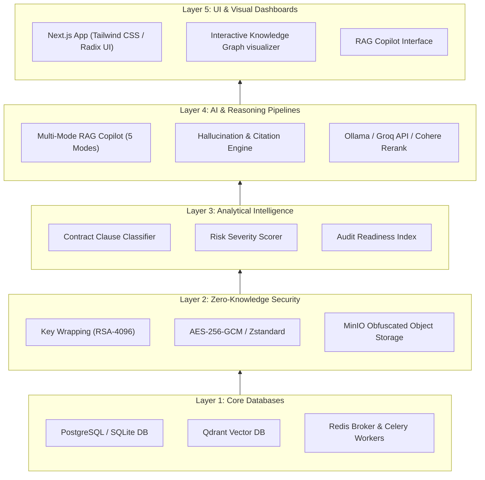
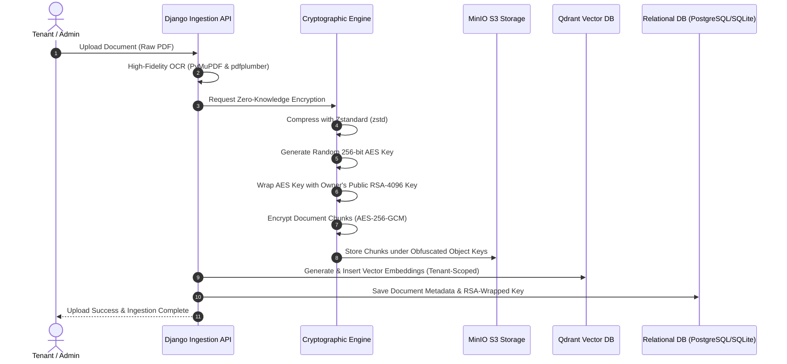
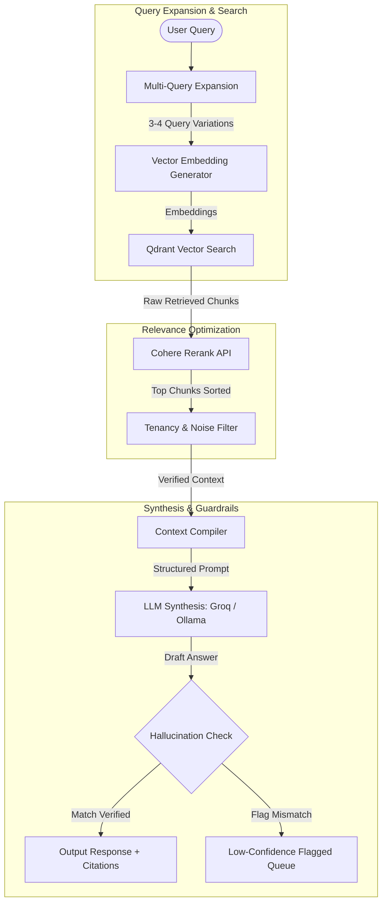
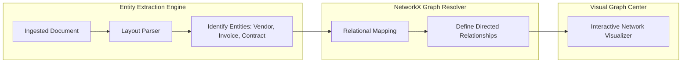

# 🔒 Novara AI: Zero-Knowledge Document Intelligence & Enterprise Governance Platform

[](https://opensource.org/licenses/MIT)
[](https://www.djangoproject.com/)
[-000000.svg?style=flat&logo=nextdotjs)](https://nextjs.org/)
[](https://qdrant.tech/)
[](https://min.io/)
[](https://docs.celeryq.dev/)

Novara AI (also known as **Avora AI** / **SecureVault**) is an enterprise-grade, zero-knowledge document intelligence platform and organizational memory system. It transforms raw corporate documents—including contracts, invoices, receipts, and compliance filings—into an active, securely queryable knowledge base. 

The platform guarantees absolute cryptographic privacy, providing semantic search, a multi-mode RAG Copilot with hallucination guardrails, contract clause parsing, audit score tracking, and automated relational Enterprise Knowledge Graphs.

---

## 🏗️ Macro System Architecture

Novara AI operates on a tiered, security-first architectural stack. Databases and task queues power the encrypted storage layers, which feed intelligence pipelines that compile results for the Next.js visual interfaces.



---

## ⚙️ Core Technical Workflows

### 1. Ingestion and Zero-Knowledge Security Pipeline
To safeguard enterprise assets, uploaded documents are cryptographically isolated on the server before they are persisted in object storage or indexed for search.



---

### 2. Multi-Mode RAG Copilot & Query Pipeline
Users consult their corporate intelligence via a structured retrieval pipeline featuring query expansion, reranking, and verification checks.



---

### 3. Enterprise Knowledge Graph Construction
Relations between vendors, files, obligations, and financial entities are mapped dynamically using network theory algorithms.



---

## ⚡ Core Features & Capabilities

*   **Zero-Knowledge Key Wrapping:** For every document, a unique 256-bit AES symmetric key is generated. This symmetric key is then wrapped using an RSA-4096 tenant key.
*   **Obfuscated Object Storage:** Chunks encrypted with AES-256-GCM are stored in MinIO using UUID-based keys. Storage administrators can never link object storage contents to their respective original filenames.
*   **Deep Document Intelligence:** Parsing pipelines leverage PyMuPDF, python-docx, pdfplumber, and openpyxl, automatically mapping tags, summaries, categories, and departments.
*   **Compliance & Contract Intelligence:** Clause classifiers scan contracts for specific provisions (such as Liability, Termination, SLA, Renewal). Systems rate risk levels (Low, Medium, High, Critical) and trigger alert sequences at 90/60/30-day notice thresholds.
*   **Audit Readiness Index:** Evaluates overall corporate audit compliance status based on missing documents, expiration logs, and validation matrices.
*   **Multi-Mode RAG Copilot:** High-security interface offering five operating profiles:
    *   *Document Mode:* Queries limited to specific selected files.
    *   *Compliance Mode:* Verifies inputs against regulation frameworks.
    *   *Audit Mode:* Focuses on evidence collection and logs.
    *   *Knowledge Mode:* Wide multi-document organizational memory reasoning.
    *   *Risk Mode:* Analyzes financial, legal, and operational vulnerabilities.
*   **Hallucination Detection:** Outgoing LLM outputs are checked programmatically. If figures, dates, or vendor titles do not align with original source snippets, the response is routed to a manual administrator review queue.

---

## 📂 Project Structure

```directory
Avora/
├── backend/
│   ├── apps/                         # Modular Django Applications
│   │   ├── users/                    # Custom User Model, Profiles & Quotas
│   │   ├── documents/                # OCR Parsing, Chunking & Encrypted Storage Services
│   │   ├── contracts/                # Clause Extractors, Expiries & Risk Scorers
│   │   ├── compliance/               # Audit Packages & Compliance Profiles
│   │   ├── copilot/                  # Chat Conversations, Prompt Libraries & RAG
│   │   ├── knowledge/                # NetworkX Graph Models & Node Mappings
│   │   ├── ai/                       # Ollama, Groq & Cohere API Adapters
│   │   ├── audit/                    # Administrative Compliance Audit Trails
│   │   └── admin_panel/              # AI Governance, Accuracy & Latency Metrics
│   ├── securevault/                  # Core Project Configuration Settings
│   │   ├── settings/                 # Configuration Splits (Base, Dev, Prod)
│   │   ├── celery.py                 # Celery Async Tasks Configuration
│   │   ├── urls.py                   # Master URL Route Dispatcher
│   │   └── wsgi.py / asgi.py         # App Servers Entrypoints
│   ├── utils/                        # Infrastructure Helper Libraries
│   │   ├── minio_client.py           # S3 Object Storage Interface
│   │   └── qdrant_client.py          # Vector Database Helper
│   ├── tests/                        # Backend Pytest Test Cases
│   ├── scripts/                      # DB Seeding & Ingestion Helper Scripts
│   ├── manage.py                     # Django Command-Line Utility
│   └── Dockerfile                    # Containerization Spec
├── frontend/
│   ├── src/
│   │   ├── app/                      # Next.js App Router Structure
│   │   │   ├── (auth)/               # Login, Sign Up, Verification Views
│   │   │   ├── (dashboard)/          # Application Views
│   │   │   │   ├── dashboard/        # Central Analytics UI
│   │   │   │   ├── upload/           # Drag-and-Drop Ingestion Hub
│   │   │   │   ├── documents/        # File Management & Trees
│   │   │   │   ├── copilot/          # Interactive Multi-Mode Chat
│   │   │   │   ├── knowledge/        # NetworkX Visual Node Map
│   │   │   │   ├── compliance/       # Audit Scores & Checklist UIs
│   │   │   │   ├── contracts/        # Clause & Expiry Dashboards
│   │   │   │   └── risk/             # Financial & Legal Threat Matrices
│   │   │   └── securevault-admin/    # AI Performance & Latency Analytics
│   │   ├── components/               # Shareable Layout, Modal, & Form Controls
│   │   ├── hooks/                    # Custom React Hooks
│   │   ├── store/                    # Zustand Client State Stores
│   │   ├── styles/                   # Global Tailwind Styles
│   │   └── types/                    # TypeScript Typings
│   ├── next.config.mjs               # Next.js Configuration
│   ├── tailwind.config.ts            # Tailwind Design Configuration
│   └── Dockerfile                    # Containerization Spec
├── docker-compose.yml                # Multi-Container Orchestration (DB, S3, Qdrant, Redis, Ollama, App)
└── db.sqlite3                        # Relational Database File
```

---

## 🗄️ Database Schema Details

The database manages relational properties, secure wrappers, and contract meta-structures.

| Application Domain | Model Name | Description | Key Relationships |
| :--- | :--- | :--- | :--- |
| **Users & Organization** | `User` | Custom User model supporting Roles (`admin`, `user`, `viewer`). | Linked to `UserProfile` (1:1) |
| | `UserProfile` | Manages corporate metrics, company name, quota, and thresholds. | Relates to `User` |
| **Documents & Storage** | `Document` | Primary table recording uploaded file structures, file extensions, and status. | Relates to `User` (1:N) |
| | `DocumentChunk` | Holds storage metadata, hashes, IVs, and encryption tags for fragments. | Relates to `Document` (1:N) |
| | `DocumentEncryptionKey` | Holds the wrapped AES key encrypted with the recipient's RSA-4096 key. | Relates to `Document` (1:1) |
| | `DocumentMetadata` | Holds OCR summary, categories, keyword tags, and department metrics. | Relates to `Document` (1:1) |
| **Contracts & Alerts** | `ContractAnalysis` | Summarizes contracting parties, financial volumes, notice terms, and renewals. | Relates to `Document` (1:1) |
| | `ContractClause` | Stores distinct extracted clauses (e.g. Indemnity) with severity levels. | Relates to `ContractAnalysis` (1:N) |
| | `ExpiryAlert` | Keeps track of contract alerts, notifying at 90/60/30-day thresholds. | Relates to `ContractAnalysis` (1:N) |
| **Compliance & Audit** | `ComplianceProfile` | Maps out general corporate audit scores and lists missing items. | Relates to `UserProfile` (1:1) |
| | `AuditPackage` | A collection of generated compliance logs, files, and readiness stats. | Relates to `User` (1:N) |
| **Copilot & RAG** | `CopilotConversation` | Represents chat sessions with pinned configurations and operational profiles. | Relates to `User` (1:N) |
| | `CopilotMessage` | Captures individual prompt exchanges, thinking steps, and LLM stats. | Relates to `CopilotConversation` (1:N) |
| | `DocumentReference` | Connects a specific copilot response to verified citation indices. | Relates to `CopilotMessage` (1:N) |
| | `ReasoningLog` | Details prompt templates, confidence, and validation checks. | Relates to `CopilotMessage` (1:1) |
| **Knowledge Graph** | `KnowledgeNode` | Representing individuals, corporate files, vendors, and invoices. | Relates to `Document` / `User` |
| | `KnowledgeRelationship` | Captures connections between nodes (e.g., `invoice_of`, `reports_to`). | Relates to `KnowledgeNode` (N:M) |

---

## ⚡ API Endpoint Directory

### 1. Document Management & Ingestion
*   `POST /api/documents/upload/` — Direct multipart file upload interface (initiates OCR and key wrapping).
*   `GET /api/documents/` — Lists files using categorization, department, and storage filters.
*   `DELETE /api/documents/<id>/` — Removes document records, vector chunks, and corresponding MinIO nodes.

### 2. Copilot & Chat Systems
*   `POST /api/copilot/query/` — Core RAG prompt router. Processes user inputs and returns sources, scores, and logs.
*   `GET /api/copilot/conversations/` — Lists active user chats with filters for pinned sessions.
*   `POST /api/copilot/reports/generate/` — Compiles auto-generated regulatory reports or analysis briefs.

### 3. Contract & Risk Analytics
*   `GET /api/contracts/clauses/` — Pulls clause classifications and identifies compliance deviations.
*   `GET /api/contracts/expiries/` — Lists upcoming contract terms, notifications, and notice timelines.
*   `GET /api/compliance/status/` — Fetches current corporate readiness ratings and compliance indicators.

### 4. Graph & Visualizations
*   `GET /api/knowledge/graph/` — Pulls complete node-link arrays to generate graph network views.
*   `POST /api/knowledge/build/` — Initiates an analysis run to rebuild the network graph.

---

## 🛠️ Sandbox Quick Start

### 1. Configure Environment Profiles
Copy variables for the local systems:
```bash
cp .env.example .env
cp backend/.env.example backend/.env
cp frontend/.env.local.example frontend/.env.local
```

### 2. Boot Service Containers
Use Docker Compose to run PostgreSQL/SQLite, MinIO, Redis, Celery, Qdrant, and the Django/Next.js services:
```bash
docker-compose up -d --build
```

### 3. Run Migrations & Admin setup
Configure the database structures and setup a superuser:
```bash
docker-compose exec backend python manage.py migrate
docker-compose exec backend python manage.py createsuperuser
```

### 4. Configure Local Ollama models
Download the vector embedding and generation models to the local agent:
```bash
docker-compose exec ollama ollama pull nomic-embed-text
docker-compose exec ollama ollama pull llama3.2:1b
```

### 5. Seed Copilot Prompts
Insert default prompt system templates into the database:
```bash
docker-compose exec backend python manage.py shell -c "
from apps.copilot.services.prompt_library import seed_builtin_prompts
print(seed_builtin_prompts(), 'prompts successfully seeded')
"
```

### 6. Endpoint Locations
*   **Web Portal Portal:** `http://localhost:3000`
*   **Audit Console:** `http://localhost:3000/securevault-admin`
*   **Interactive API Docs (Swagger):** `http://localhost:8000/swagger/`
*   **MinIO Console (S3 Admin):** `http://localhost:9001`

---
*Novara AI converts passive records into a unified, cryptographically secure enterprise knowledge graph.*
